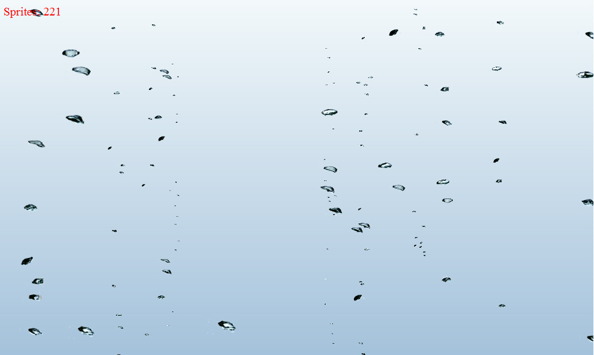

<h1>HTML5 эффект пузырьков воздуха в воде</h1>

Анимированные спрайты появляются внизу экрана и плано всплывают до исчезноваения.

Для работы скрипта необходима библиотека jquery и браузер, поддерживающий HTML5 и теги canvas (FF, Opera, Chrome, IE9). Скрипт работает без тормозов даже на слабых системах при количестве подвижных спрайтов до 500 шт..

